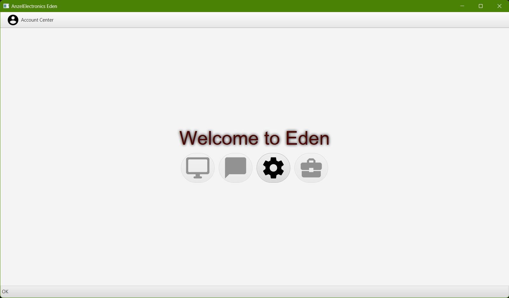
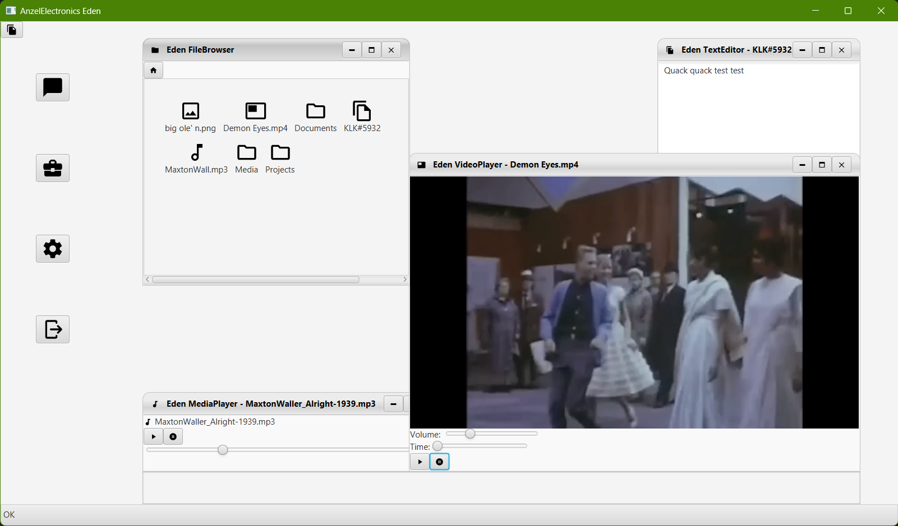

# Eden

Eden is a Call of Cthulhu Prop for games in the modern age. It allows for a person to login to an account, view their personal data and read messages/news. All this data is created by the user before hand. 

## Description

A prop for modern homebrewed Call of Cthulhu/Delta Green games. If your campaign/scenario requires a corporate style employee program, then this should do. You can create EdenUsers inside the code to login to. All you have to do is supply any type of documents or media that your players need to find, and put it in the correct folders. The [CUSTOMIZING](CUSTOMIZING.md)* file is a guide on how to setup and prepare your files to be used with Eden. 

*Until this link goes to an actual page, this is a WIP

Any bugs that arise during development will be documented in the [Bugs](Bugs.md) file. I have a header at the top that details on how I'll lay them out if and when I find them. I'm also going to attempt to document what I change when I do it inside the [Changelog](ChangeLog.md) file.

## AnzelElectronics Pitch

We at AnzelElectronics take pride in our employees, and we realize that using tech from yesteryears supplies a myriad of problems! So we've developed the newest Employee Portal Program for use here at AnzelElectronics! Eden! Eden will allow you to keep in touch with your fellow employees while still getting your work done! Eden is to be used starting immediately at all AnzelElectronics offices! 

## Getting Started

Eden was written with JDK21 and the following libraries:

* [JavaFX](https://openjfx.io/openjfx-docs/#introduction) - 21.0.1
* [DesktopPaneFX](https://github.com/kordamp/desktoppanefx) - 0.15.0
* [TinyLog2](https://tinylog.org/v2/) - 2.6.2
* [ControlsFX](https://central.sonatype.com/artifact/org.controlsfx/controlsfx) - 11.1.2
* [IkonliFX](https://github.com/kordamp/ikonli/) - 12.3.1
* [Gradle](https://gradle.org) - 8.4

When you pull the project off github, import it as a gradle project into whichever IDE you decide, it should then pull whatever dependencies it needs from maven and then you can run it by launching the Main.java file located in the io.azraein.eden package.

### Running

* Make sure to go into the EdenFileUtils.java inside of the io.azraein.eden.logic package, and change the [EDEN_FILE_LOCATION](https://github.com/CaptainSly/Eden/blob/9a31b7a99e5d39c67d41a057821f2c94e15a5553/src/main/java/io/azraein/eden/logic/EdenFileUtils.java#L11C2-L11C78) variable to a location somewhere on your filesystem. The Program should then run in an IDE afterwards. 

## Authors

Contributors names and contact info

* [CaptainSly](https://github.com/CaptainSly)

## Version History

* 0.1
    * Initial Release - A workable Lobby Page and the ability to login to an account. 

## License

This project is licensed under the GNU GPLv3 License - see the [LICENSE.md](LICENSE.md) file for details